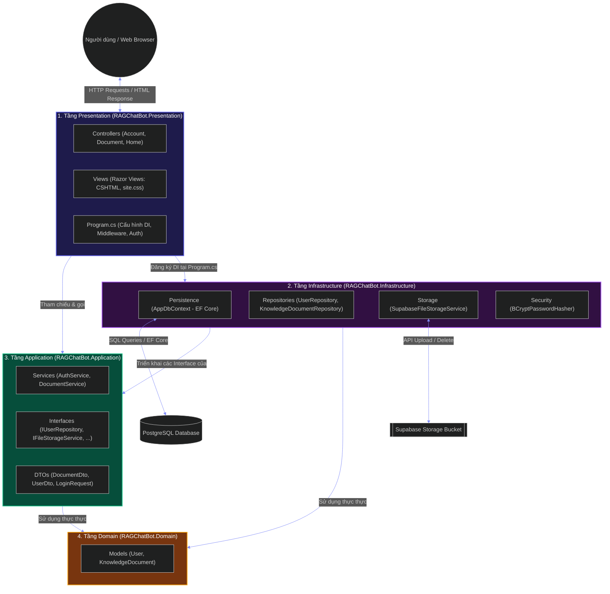
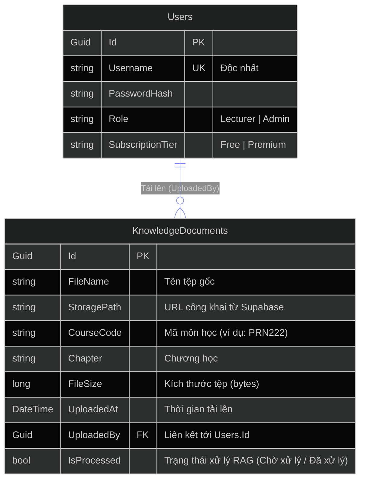

# RAG ChatBot - Tài liệu Kiến trúc Hệ thống (System Architecture)

Tài liệu này mô tả chi tiết kiến trúc phần mềm của dự án **RAG ChatBot**, được xây dựng dựa trên nguyên lý **Kiến trúc Sạch (Clean Architecture)** với các công nghệ hiện đại như .NET 9, ASP.NET Core MVC, Entity Framework Core, PostgreSQL và dịch vụ lưu trữ Supabase Storage.

> [!NOTE]
> **Khắc phục lỗi hiển thị/UnknownDiagramError**: Nếu công cụ xem (Mermaid previewer/editor extension) của bạn cố gắng phân tích cú pháp toàn bộ tệp Markdown `.md` này như một biểu đồ Mermaid dẫn đến lỗi, bạn hãy mở trực tiếp các tệp sơ đồ Mermaid độc lập (chỉ chứa mã sơ đồ) được đặt trong thư mục `docs/`:
> *   Sơ đồ các Tầng Kiến trúc: [architecture_layers.mermaid](file:///e:/developer/code/personal-project/RAGChatBot/docs/architecture_layers.mermaid)
> *   Sơ đồ Cơ sở Dữ liệu (ERD): [architecture_erd.mermaid](file:///e:/developer/code/personal-project/RAGChatBot/docs/architecture_erd.mermaid)
> *   Sơ đồ Luồng hoạt động (Sequence): [architecture_sequence.mermaid](file:///e:/developer/code/personal-project/RAGChatBot/docs/architecture_sequence.mermaid)

---

## 1. Tổng quan về Clean Architecture trong Dự án

Hệ thống áp dụng mô hình **Clean Architecture (Onion Architecture)** nhằm đảm bảo tính độc lập, dễ kiểm thử (testability), dễ bảo trì và mở rộng. Nguyên tắc cốt lõi là **Luồng phụ thuộc luôn hướng vào trong (Dependency Inversion)**: Các tầng ngoài cùng phụ thuộc vào các tầng bên trong, nhưng các tầng bên trong tuyệt đối không biết gì về các tầng bên ngoài.

---

## 2. Chi tiết các Tầng Kiến trúc

### Tầng 1: Domain Layer (`RAGChatBot.Domain`)
*   **Vị trí**: Trung tâm của kiến trúc phần mềm.
*   **Đặc điểm**: Độc lập tuyệt đối, không tham chiếu đến bất kỳ thư viện hay dự án nào khác ngoài hệ thống.
*   **Thành phần chính**:
    *   `Models/User.cs`: Thực thể người dùng (Giảng viên, Admin) với phân quyền và gói dịch vụ (Free/Premium).
    *   `Models/KnowledgeDocument.cs`: Thực thể tài liệu học liệu (PDF, DOCX) bao gồm các siêu dữ liệu như đường dẫn lưu trữ, mã môn học, chương học, kích thước tệp, trạng thái xử lý RAG.

### Tầng 2: Application Layer (`RAGChatBot.Application`)
*   **Vị trí**: Chứa luồng xử lý và logic nghiệp vụ cốt lõi (Core Business Rules).
*   **Đặc điểm**: Chỉ phụ thuộc vào tầng Domain. Định nghĩa các giao diện (Interfaces) cho các dịch vụ ngoại vi mà không quan tâm chúng được cài đặt cụ thể như thế nào.
*   **Thành phần chính**:
    *   `Services/`: Lớp cài đặt luồng nghiệp vụ như `DocumentService` (kiểm tra phân quyền tải tệp, kích thước tệp theo gói Subscription, gọi Storage, lưu DB) và `AuthService` (đăng nhập, xác thực).
    *   `Common/Interfaces/`: Các giao diện giao tiếp như `IUserRepository`, `IKnowledgeDocumentRepository`, `IFileStorageService` (lưu tệp), `IPasswordHasher` (mã hóa mật khẩu).
    *   `DTOs/`: Các đối tượng vận chuyển dữ liệu tối giản giữa Presentation và Application (`DocumentDto`, `UserDto`, `LoginRequest`).

### Tầng 3: Infrastructure Layer (`RAGChatBot.Infrastructure`)
*   **Vị trí**: Chứa các chi tiết kỹ thuật công nghệ bên ngoài (External Concerns).
*   **Đặc điểm**: Triển khai các Interfaces được định nghĩa ở tầng Application. Phụ thuộc vào Application và Domain.
*   **Thành phần chính**:
    *   `Persistence/AppDbContext.cs`: Lớp ngữ cảnh cơ sở dữ liệu EF Core, ánh xạ các Entity thành các bảng trong PostgreSQL.
    *   `Persistence/Repositories/`: Cài đặt thực tế truy cập dữ liệu (`UserRepository`, `KnowledgeDocumentRepository`).
    *   `Storage/SupabaseFileStorageService.cs`: Tích hợp với **Supabase Storage** Client API để tải lên (Upload) và xóa các tệp tin thô trong bucket `raw-documents`.
    *   `Security/BCryptPasswordHasher.cs`: Sử dụng thuật toán BCrypt để mã hóa bảo mật mật khẩu người dùng.

### Tầng 4: Presentation Layer (`RAGChatBot.Presentation`)
*   **Vị trí**: Điểm tiếp xúc trực tiếp với người dùng cuối và thiết lập khởi tạo ứng dụng.
*   **Đặc điểm**: Phụ thuộc vào Application và Infrastructure (để cấu hình Dependency Injection trong `Program.cs`). Sử dụng kiến trúc MVC.
*   **Thành phần chính**:
    *   `Controllers/`: Các bộ điều hướng xử lý HTTP Request (`HomeController`, `AccountController`, `DocumentController`).
    *   `Views/`: Các trang Razor View hiển thị giao diện UI hiện đại, kết hợp với Bootstrap, FontAwesome và các hiệu ứng CSS Glassmorphism cao cấp (`_Layout.cshtml`, `Document/Index.cshtml`, `Account/Login.cshtml`).
    *   `Program.cs`: Nơi cấu hình đường truyền HTTP request (Middleware pipeline), Cookie Authentication, kết nối chuỗi PostgreSQL, và đăng ký vòng đời dịch vụ (DI container).

---

## 3. Sơ đồ thực thể Cơ sở Dữ liệu (Entity Relationship Diagram)

Cơ sở dữ liệu được ánh xạ thông qua Entity Framework Core lên PostgreSQL DB với cấu trúc đơn giản, chặt chẽ để quản lý Tài liệu học liệu và Người dùng.

---

## 4. Luồng hoạt động: Upload Tài liệu học liệu (Sequence Diagram)

Sơ đồ dưới đây biểu diễn chi tiết cách các thành phần trong các tầng kiến trúc khác nhau tương tác với nhau khi Giảng viên thực hiện tải lên một tài liệu học liệu mới (.pdf hoặc .docx).

```mermaid
%%{init: {
  "theme": "dark",
  "themeVariables": {
    "background": "#090d16",
    "primaryColor": "#6366f1",
    "primaryTextColor": "#ffffff",
    "primaryBorderColor": "#4f46e5",
    "lineColor": "#818cf8",
    "actorBkg": "#1e293b",
    "actorBorder": "#6366f1",
    "actorTextColor": "#ffffff"
  }
}}%%
sequenceDiagram
    autonumber
    actor Lecturer as Giảng viên
    participant Ctrl as DocumentController<br/>(Presentation)
    participant Service as DocumentService<br/>(Application)
    participant Storage as SupabaseStorageService<br/>(Infrastructure)
    participant Cloud as Supabase Storage<br/>(External Cloud)
    participant Repo as DocumentRepository<br/>(Infrastructure)
    participant DB as PostgreSQL Database<br/>(External DB)

    Lecturer->>Ctrl: Gửi yêu cầu Upload File (POST Form kèm File, Course, Chapter)
    Note over Ctrl: Trích xuất thông tin User<br/>(Id, SubscriptionTier từ Cookie Claims)
    
    Ctrl->>Service: UploadDocumentAsync(fileStream, fileName, size, course, chapter, userId, tier)
    
    rect rgb(20, 20, 45)
        Note over Service: Logic Nghiệp vụ (Business Validation):<br/>1. Đuôi tệp hợp lệ (.pdf, .docx)?<br/>2. Dung lượng tệp vượt quá hạn mức Gói cước (Free: 5MB / Premium: 50MB)?
    end

    alt Tệp không hợp lệ hoặc Vượt giới hạn dung lượng
        Service-->>Ctrl: Ném ngoại lệ (Exception với thông điệp chi tiết)
        Ctrl-->>Lecturer: Hiển thị thông báo lỗi lên giao diện (TempData["Error"])
    else Kiểm tra hợp lệ thành công
        Service->>Storage: SaveFileAsync(fileStream, fileName)
        
        rect rgb(30, 20, 45)
            Note over Storage: Tạo tên tệp duy nhất (unique)<br/>dùng Guid tránh trùng lặp
            Storage->>Cloud: Upload file dưới dạng byte array lên bucket 'raw-documents'
            Cloud-->>Storage: Tải lên thành công
            Storage->>Storage: Lấy đường dẫn URL công khai (GetPublicUrl)
        end
        
        Storage-->>Service: Trả về URL StoragePath (đường dẫn Supabase Public URL)
        
        Service->>Repo: AddAsync(KnowledgeDocument Entity mới chứa metadata & URL)
        Repo->>DB: INSERT INTO "KnowledgeDocuments"
        
        Service->>Repo: SaveChangesAsync()
        Repo->>DB: Commit Transaction
        DB-->>Repo: Xác nhận lưu DB thành công
        
        Service-->>Ctrl: Trả về thông tin Document dưới dạng DocumentDto
        Ctrl-->>Lecturer: Chuyển hướng về trang Index kèm thông báo thành công!
    end
```

---

## 5. Tổng kết Kỹ thuật & Công nghệ (Tech Stack)

| Thành phần | Công nghệ / Thư viện sử dụng | Vai trò trong hệ thống |
| :--- | :--- | :--- |
| **Core Framework** | .NET 9 (C#) | Nền tảng cốt lõi hiệu năng cao |
| **Presentation Web** | ASP.NET Core MVC (Razor Views) | Xây dựng giao diện Web responsive, bảo mật và thân thiện |
| **Security Auth** | Cookie Authentication | Lưu giữ phiên đăng nhập an toàn, cơ chế Claims-based để phân quyền |
| **Database ORM** | Entity Framework Core & Npgsql | Kết nối PostgreSQL tự động sinh schema qua EF Core Migrations |
| **Physical Storage** | Supabase Storage SDK for .NET | Lưu trữ tệp tài liệu vật lý phân tán dạng Cloud Object Storage |
| **Security Hash** | BCrypt.Net-Next | Mã hóa một chiều chống tấn công từ điển mật khẩu |
| **CSS Styling** | Custom CSS + Bootstrap 5 + FontAwesome 6 | Xây dựng giao diện tối, hiệu ứng Glassmorphism lôi cuốn |
