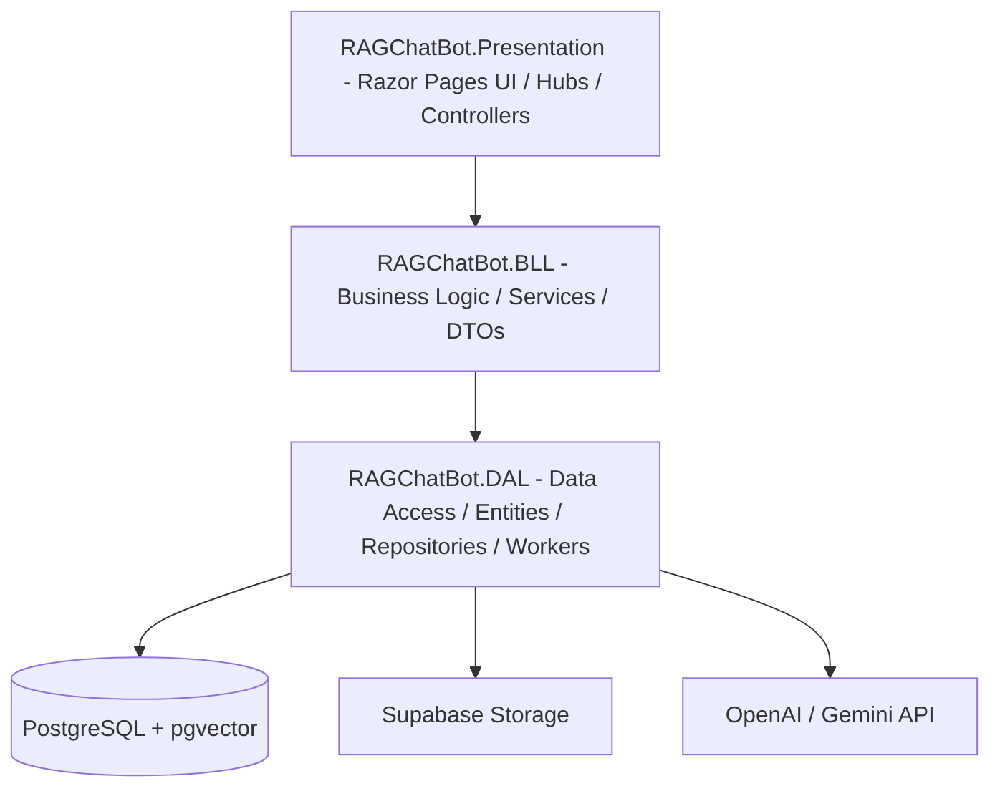

# RAGChatBot Project Architecture Overview

This document provides a comprehensive breakdown of the **RAGChatBot** project architecture and structure, explored and mapped using **CodeGraph**.

---

## 🌟 Technology Stack & Features

- **Backend Framework**: .NET 9.0 Web Application (Razor Pages)
- **Database**: PostgreSQL with `pgvector` extension for semantic search embeddings
- **Object Relational Mapper (ORM)**: Entity Framework Core (EF Core)
- **Cloud Storage**: Supabase File Storage (via `Supabase.Client`)
- **Authentication**: Cookie Authentication & Google OAuth
- **RAG & AI Services**: 
  - Text Extraction (`.pdf`, `.docx`)
  - Semantic Chunking & Vectorization (OpenAI 1536-dimension embeddings)
  - LLM Chat Integration (compatible with Gemini/OpenAI endpoints)
  - Auto-generated Quizzes from documents
- **Real-time Communication**: SignalR (`DocumentHub` for UI updates)
- **Security & Optimization**: Custom Fixed-Window Rate Limiting (`StudentChatLimit`), Global Exception Middlewares, and Serilog logging.

---

## 📁 Project Architecture & Modules

The repository is structured into a classic 3-Tier clean architecture:

### 1. 🖥️ Presentation Layer (`RAGChatBot.Presentation`)
Contains the user interface, API endpoints (via Razor Pages), Middlewares, SignalR hubs, and host configurations.
- **Entry Point ([Program.cs](file:///e:/developer/code/PRN222_ASM/RAGChatBot.Presentation/Program.cs))**: Configures dependency injection, database migrations & seeding, authentication, SignalR, rate limiters, Exception Middlewares, and AI connection health check.
- **Hubs**:
  - `DocumentHub.cs`: Real-time SignalR notifications for document processing states.
- **Middlewares**:
  - `ExceptionHandlingMiddleware.cs` & `GlobalExceptionMiddleware.cs`: Intercept exceptions globally and return clean API responses.
- **Pages**:
  - `/Account`: Razor pages for Login and Logout.
  - `/Admin`: Admin dashboard, payment tracking, whitelist email management, and user management.
  - `/Courses`: Document exploration and course listings.
  - `/Subscription`: VNPay checkout, plan features, and payment callback processing.
  - `/api`: API-like Razor pages (e.g., `ChatApi.cshtml`, `ChatThreadsApi.cshtml`, `QuizApi.cshtml`).

---

### 2. ⚙️ Business Logic Layer (`RAGChatBot.BLL`)
Defines the business logic, DTO models, and interfaces/orchestrations of services.
- **DTOs (Data Transfer Objects)**:
  - `UserDto`, `CourseDto`, `DocumentDto`, `ChunkDto`, `PaymentTransactionDto`, `DashboardDto`
- **Services**:
  - [AuthService.cs](file:///e:/developer/code/PRN222_ASM/RAGChatBot.BLL/Services/AuthService.cs): Handle authentication and registration.
  - [DocumentService.cs](file:///e:/developer/code/PRN222_ASM/RAGChatBot.BLL/Services/DocumentService.cs): Document uploads, metadata changes, metadata checks (e.g., file-size constraints per user tier), approval, and deletion.
  - [QuizService.cs](file:///e:/developer/code/PRN222_ASM/RAGChatBot.BLL/Services/QuizService.cs): Integrates LLMs to automatically generate multiple-choice quizzes from document contents, record attempts, and submit/score them.
  - `CreditService.cs` & `DailyCreditResetService.cs`: Manages daily free chat credits (e.g., 10 queries/day limit for free tier) and resets them.
  - `VnPayService.cs` & `PaymentService.cs`: Processes subscriptions, generates payment URLs, and handles callbacks.

---

### 3. 💾 Data Access Layer (`RAGChatBot.DAL`)
Handles data persistence, DB schema mapping, repository implementations, low-level file extraction, and background processing workers.
- **Context ([AppDbContext.cs](file:///e:/developer/code/PRN222_ASM/RAGChatBot.DAL/Context/AppDbContext.cs))**:
  - Maps database tables and initializes the PostgreSQL `vector` extension.
  - Configures `DocumentChunk` with a `vector(1536)` database column.
- **Entities**:
  - `User`: Accounts, Roles (`Admin`, `Lecturer`, `Student`), and Tiers (`Free`, `Premium`).
  - `KnowledgeDocument` & `DocumentChunk`: Document metadata and raw text splits associated with vector embeddings.
  - `Course`: Code, Name, and Course Leader ID.
  - `ChatThread` & `ChatMessage`: Persistent messaging history for the chatbot.
  - `QuizAttempt` & `QuestionBank`: Quiz questions generated from documents and students' attempt scores.
  - `ChatTrackerLog`, `WhitelistEmail`, `PerformanceBenchmark`, `ChatSession`, `PaymentTransaction`.
- **Infrastructure Services**:
  - `DocumentProcessingWorker.cs`: Background `IHostedService` that monitors pending documents, extracts text via `TextExtractor`, creates semantic chunks, generates embeddings using `OpenAiEmbeddingService`, and saves them to the DB.
  - `OpenAiChatService.cs` & `OpenAiEmbeddingService.cs`: Integrations with external AI APIs.
  - `SupabaseFileStorageService.cs`: Connects to Supabase storage buckets to save/retrieve physical documents.
  - `TextExtractor.cs`: Utility using libraries to parse content from `.pdf` and `.docx`.
